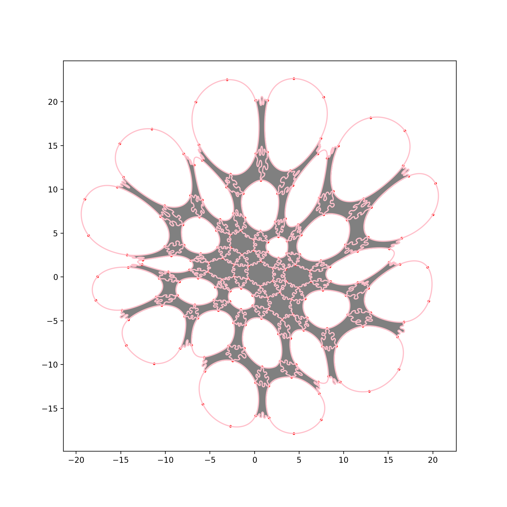
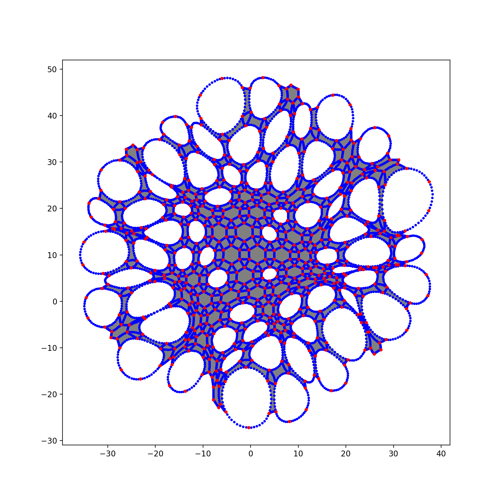
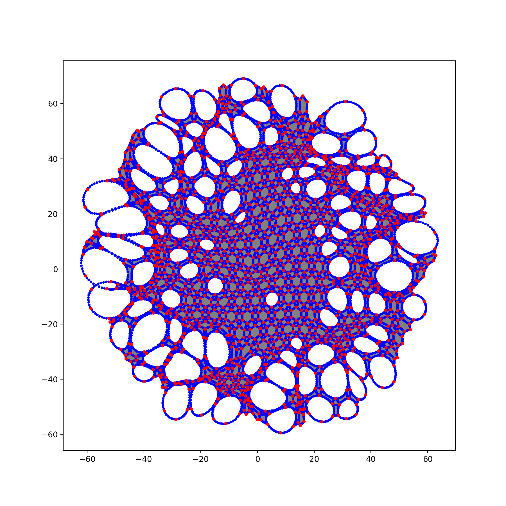

# Tessellation puzzles with holes.

## Introduction

This library contains code for randomly generating puzzles that look like radial
tessellations with holes.

## Dependencies

```
pip install numpy
pip install matplotlib
```

## Usage

In this directory, run `$python main_plot_puzzle.py`. This should plot a figure
rendering a puzzle. The puzzle parameters are specified by files in `configs/`.
You can choose a config to plot via the `_CONFIG` file in `main_plot_puzzle.py`.
To explore new parameters, fork and add config files in `configs/`. To explore
new spatial transformations to the puzzle, add files to `transforms/`. To
explore new tessellations, add files to `tessellations/`.

## Examples

Here is a puzzle generated from config `configs/degree_3_4_6_4_tiny_v0.py` with
edge-warping:



Here is a puzzle generated from config `configs/degree_3_4_6_4_small_v0.py`
before edge-warping was added:



Here is a puzzle generated from config `configs/degree_3_4_6_4_medium_v0.py`:


